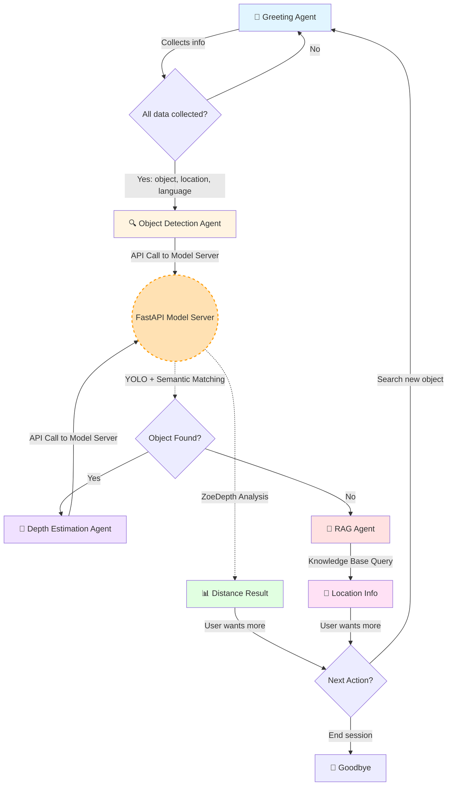

# Smart Voice Navigator 🗣️🔍

A real-time, multilingual voice-powered navigation assistant that helps visually impaired users locate objects in indoor environments using computer vision and conversational AI.

## Overview

Smart Voice Navigator is an intelligent voice assistant designed to help users find objects within a building or home environment. The system combines advanced speech recognition, natural language processing, object detection, and depth estimation to provide an interactive, hands-free navigation experience in multiple Indian languages.

## Features

- **🎙️ Multilingual Voice Interaction**: Supports 11 Indian languages including Hindi, Tamil, Telugu, Bengali, Kannada, Malayalam, Marathi, Odia, Punjabi, Gujarati, and English
- **👁️ Real-time Object Detection**: Uses YOLO11n for fast and accurate object recognition
- **📏 Depth Estimation**: Calculates distance to detected objects using ZoeDepth neural network
- **🤖 Multi-Agent Architecture**: Intelligent agent orchestration for handling different navigation tasks
- **🔊 Noise Cancellation**: Built-in BVC (Background Voice Cancellation) for clear audio in noisy environments
- **🌐 Real-time Communication**: Powered by LiveKit for low-latency voice streaming
- **🧠 Semantic Matching**: Uses sentence embeddings to intelligently match user queries to detected objects

## Architecture

The application uses a decoupled multi-agent system where heavy ML inference is offloaded to a dedicated FastAPI model server, while the conversational flow is managed by LiveKit agents:



### Agent Breakdown

1. **Greeting Agent**: Initial entry point that collects context (object, location, language).
2. **ObjectDetection Agent**: Confirms object detection through the FastAPI model server using semantic similarity and handles partial matches.
3. **DepthEstimation Agent**: Defers monocular depth estimation to the model server and interprets the real-world distance in meters.
4. **RAG Agent**: Fallback option when object detection fails to query the knowledge base.

### Model Server (FastAPI)
- Handles heavy computer vision and embedding models (YOLO11n, Intel ZoeDepth, Multilingual Sentence Transformers).
- Exposes fast, asynchronous REST endpoints (`/detect` and `/depth`).
- Runs independently to prevent event-loop blocking and ensure smooth real-time voice responses.

## Technology Stack

### Core Frameworks
- **LiveKit Agents**: Real-time voice interaction framework
- **Sarvam AI**: Indian language STT (Speech-to-Text) and TTS (Text-to-Speech)
- **Google Gemini Flash**: LLM for natural language understanding and conversation

### Computer Vision
- **YOLOv11n**: Lightweight object detection model
- **Intel ZoeDepth**: Monocular depth estimation
- **Sentence Transformers**: Multilingual semantic similarity matching

### Voice Processing
- **Silero VAD**: Voice Activity Detection
- **Multilingual Turn Detection**: Handles conversation turn-taking across languages
- **BVC Noise Cancellation**: Background voice cancellation

## Installation & Usage

The recommended way to run the application is using **Docker**, which bundles the Model Server, LiveKit Voice Agent, and all ML dependencies.

### Option A: Using Docker (Recommended)

1. **Clone the repository**
```bash
git clone https://github.com/21lakshh/Smart-Voice-Navigator.git
cd Smart-Voice-Navigator
```

2. **Set up environment variables**
Create a `.env` file in the project directory:
```bash
LIVEKIT_URL=<your-livekit-server-url>
LIVEKIT_API_KEY=<your-api-key>
LIVEKIT_API_SECRET=<your-api-secret>
SARVAM_API_KEY=<your-sarvam-api-key>
GOOGLE_API_KEY=<your-google-api-key>
```

3. **Build and Run**
```bash
# Build the unified container (downloads ML models into cache during build)
docker build -t drishti-app .

# Run the container (starts both the FastAPI server and LiveKit voice agent)
docker run -p 4000:4000 -p 8000:8000 --env-file .env drishti-app
```

### Option B: Local Setup (Development)

1. **Clone and setup virtual environment**
```bash
git clone https://github.com/21lakshh/Smart-Voice-Navigator.git
cd Smart-Voice-Navigator
python -m venv venv
source venv/bin/activate  # On Windows: venv\Scripts\activate
pip install -r requirements.txt
```

2. **Set up `.env` file** with the keys listed above.

3. **Start the applications** in separate terminal windows:
```bash
# Terminal 1: Start the FastAPI Model Server
uvicorn model_server:app --host 0.0.0.0 --port 8000

# Terminal 2: Start the LiveKit Voice Agent
python agent.py dev
```

### Connect via LiveKit Client
- Use LiveKit's web/mobile client to connect to your room.
- Start speaking to interact with the assistant in real-time.

## Project Structure

```
Smart-Voice-Navigator/
├── agent.py              # Main application with LiveKit conversational agent logic
├── model_server.py       # FastAPI server hosting YOLO and ZoeDepth models
├── Dockerfile            # Unified container configuration
├── start.sh              # Wrapper script to run both servers locally/in Docker
├── requirements.txt      # Combined Python dependencies
├── yolo11n.pt            # YOLO11 model weights (cached locally)
├── .env                  # Environment variables (not in repo)
└── README.md             # This file
```

## Key Components

### UserData Class
Maintains state across agent transitions:
- `object_to_find`: Target object name
- `user_location`: Current user location
- `preferred_language`: User's chosen language
- `object_found`: Detection status
- `detected_box`: Bounding box coordinates
- `object_image`: Path to image for analysis

### BaseAgent Class
Foundation for all agents with:
- Context preservation across agent transfers
- Chat history management
- Automatic language preference application

### Function Tools
Each agent exposes function tools that the LLM can call:
- `update_object_to_find()`
- `update_user_location()`
- `update_user_preferred_language()`
- `start_detection()`
- `to_depth_estimation()`
- `to_rag()`
- `search_new_object()`
- `end_session()`

## Health Check

The application exposes a health check endpoint for monitoring:

```bash
curl http://localhost:4000/healthz
# Response: ok
```

---

**Note**: This is a research/prototype project. For production use, additional testing, security hardening, and error handling are recommended.
